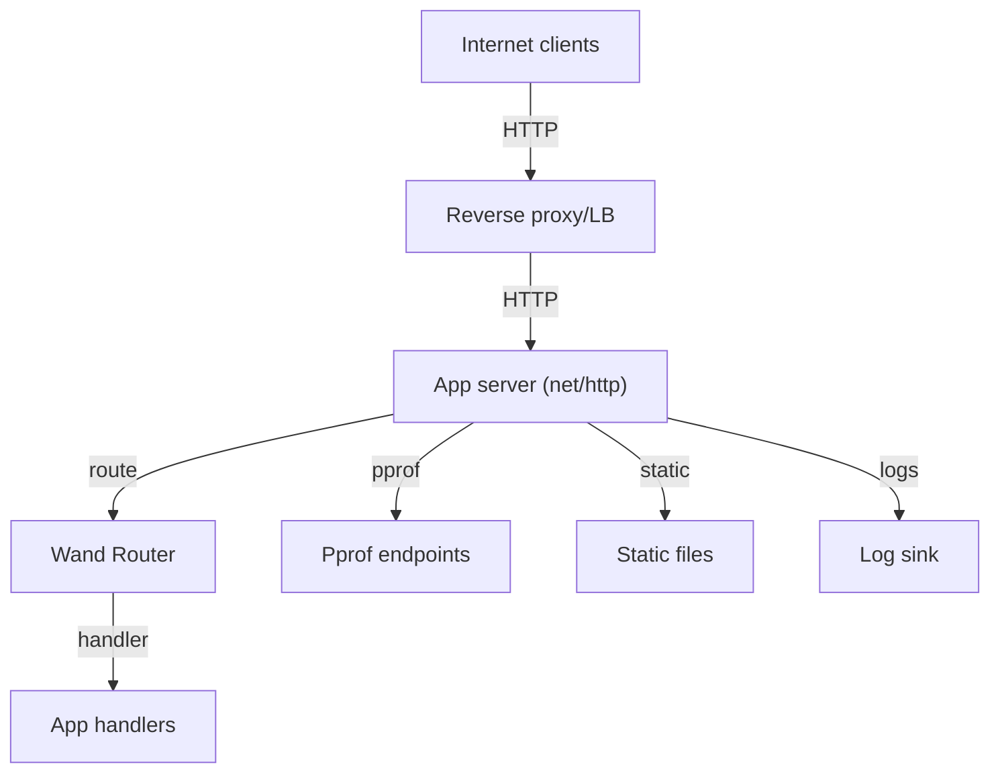

## Executive summary
Wand is a Go HTTP router library intended to be embedded in internet-facing, multi-tenant services with high-sensitivity data. The highest risks are configuration- and integration-driven: path/host normalization mismatches across proxies and the router can lead to route or tenant-isolation bypasses; missing server timeouts or request body limits can enable resource exhaustion; and operational surfaces (pprof, static files, trusted proxy headers, CORS) can be exposed or misconfigured, leading to information disclosure or control bypass. The library includes guardrails and guidance, but the consuming service must apply them consistently.

## Scope and assumptions
- In-scope paths: `router/`, `middleware/`, `server/`, `docs/`, `.github/workflows/`.
- Out-of-scope: application handlers and data stores using the router; authentication/authorization logic (explicitly provided by upstream services); deployment infrastructure beyond the provided docs; tests, benchmarks, and `cmd/` utilities.
- Assumptions:
  - Internet-exposed HTTP services use Wand as the primary request router.
  - Data sensitivity is high (compliance, secrets, payments).
  - AuthN/AuthZ are enforced outside this repo (upstream service/gateway).
  - Pprof/metrics endpoints are internal-only.
  - Multi-tenancy is enabled/expected; tenant isolation is enforced upstream (not in this repo).
  - Go toolchain is maintained at patched versions (Go 1.24.12+).
- Open questions (would change risk ranking):
  - How are tenants identified (host/path/header), and which component enforces tenant isolation?
  - Which reverse proxy/LB normalizes paths and headers, and how is double-decoding prevented?
  - Are request size limits and connection timeouts enforced at the edge (WAF/proxy) in addition to `net/http`?

## System model
### Primary components
- **Wand Router**: `Router` and `FrozenRouter` implement `http.Handler` and perform path matching, param extraction, and routing decisions. (Evidence: `router/router.go:529-702`, `router/serve.go:17-60`)
- **Middleware utilities**: CORS, BodySizeLimit, Logger, RequestID, Static file server, Trusted Proxy helpers. (Evidence: `middleware/cors.go:9-127`, `middleware/body_limit.go:5-13`, `middleware/logger.go:14-276`, `middleware/request_id.go:11-45`, `middleware/static.go:12-77`, `middleware/trusted_proxy.go:9-96`)
- **Pprof registration helper**: optional HTTP handlers guarded by explicit allow policy. (Evidence: `router/pprof.go:27-90`)
- **Server helper**: graceful shutdown wrapper around `http.Server`. (Evidence: `server/graceful.go:22-52`)
- **Security guidance and CI scans**: documented hardening guidance and scheduled govulncheck/gosec scans. (Evidence: `docs/security.md:5-64`, `.github/workflows/vuln.yml:1-27`, `.github/workflows/security.yml:1-26`)

### Data flows and trust boundaries
- **Internet client → Reverse proxy / LB → App server (net/http)**
  - Data: HTTP method, headers, path, body, host.
  - Channel: HTTPS terminated at proxy, HTTP between proxy and app (assumed).
  - Guarantees: TLS at edge; proxy normalization and rate limits depend on deployment (assumed).
  - Validation: app-level path normalization or raw-path matching; max path length enforcement. (Evidence: `router/serve.go:18-39`)
- **App server → Wand Router → Application handlers (out-of-scope)**
  - Data: normalized match path, params; method/host routing.
  - Channel: in-process function calls.
  - Guarantees: routing decisions based on `matchPath` and `paramPath`; method handling and strict-slash redirects. (Evidence: `router/router.go:529-609`, `router/serve.go:42-59`)
- **App server → Static file server → Filesystem (configured root)**
  - Data: request path → filesystem path.
  - Channel: in-process filesystem reads.
  - Guarantees: directory listing disabled; `path.Clean` applied. (Evidence: `middleware/static.go:12-66`)
- **App server → Pprof endpoints → Profiling data**
  - Data: runtime profiles, goroutines, heap, traces.
  - Channel: HTTP handlers.
  - Guarantees: explicit allow policy required; deny defaults to 403. (Evidence: `router/pprof.go:27-55`)
- **App server → Logs / telemetry sink**
  - Data: method, path, status, duration, remote addr, request ID.
  - Channel: stdout/structured logs.
  - Guarantees: CR/LF sanitized in text logs; JSON formatter available. (Evidence: `middleware/logger.go:116-208`, `middleware/logger.go:252-276`)

#### Diagram

## Assets and security objectives
| Asset | Why it matters | Security objective (C/I/A) |
| --- | --- | --- |
| Sensitive business data handled by application handlers | High data sensitivity (compliance/keys/payments) | C/I |
| Tenant boundary / tenant identifiers | Prevents cross-tenant access | C/I |
| Routing integrity (path/method/host) | Controls which handler executes | I |
| Availability of HTTP service | Core infrastructure dependency | A |
| Access logs and request IDs | Forensics and detection; potential data leakage | C/I |
| Pprof profiles and runtime internals | Can expose memory addresses, goroutines, secrets | C |
| Static file content and filesystem root | Misconfiguration can expose internal files | C |

## Attacker model
### Capabilities
- Remote attacker can send crafted HTTP requests to internet-facing services.
- Can manipulate URL encoding, paths, headers, and request bodies.
- Can attempt slow connections or large payloads to exhaust resources.
- Can exploit misconfigured proxy/header trust boundaries (e.g., spoofed `X-Forwarded-*`).
- Can attempt cross-tenant access by manipulating host/path/headers in multi-tenant deployments.

### Non-capabilities
- No direct filesystem or shell access on the server.
- Cannot modify router configuration or middleware choices (operator-controlled).
- Cannot access internal-only pprof endpoints if network isolation is enforced.

## Entry points and attack surfaces
| Surface | How reached | Trust boundary | Notes | Evidence (repo path / symbol) |
| --- | --- | --- | --- | --- |
| `Router.ServeHTTP` | Incoming HTTP requests | Internet → App server | Core routing and normalization | `router/router.go:529-589`, `router/serve.go:17-60` |
| Encoded/normalized path handling | URL path and RawPath | Internet → App server | RawPath used only when valid; otherwise clean path and redirect | `router/serve.go:18-49` |
| Static file server | HTTP GET/HEAD under prefix | Internet → App server → filesystem | Directory listing disabled; path cleaned | `middleware/static.go:12-66` |
| Pprof endpoints | `RegisterPprofWith` | Internal-only network | Explicit allow policy required | `router/pprof.go:27-55` |
| CORS preflight/requests | `Origin` and preflight headers | Internet → App server | Default no origins; wildcard+credentials rejected | `middleware/cors.go:20-127` |
| Trusted proxy headers | `X-Forwarded-*` | Internet → App server | Only trusted if ProxyTrustFunc allows | `middleware/trusted_proxy.go:34-62` |
| Request logging | Access logs | App server → log sink | CR/LF sanitized; JSON supported | `middleware/logger.go:116-208`, `middleware/logger.go:252-276` |
| Request size limiting | BodySizeLimit middleware | Internet → App server | Optional; not enforced by default | `middleware/body_limit.go:5-13` |

## Top abuse paths
1. **Path normalization mismatch** → attacker crafts encoded path that proxy decodes differently than the router → router matches a different handler than expected → authorization or routing bypass → sensitive data exposure.
2. **Tenant routing confusion** → tenant identity derived from host/path/header inconsistently across proxy and app → request routed to wrong tenant → cross-tenant data access.
3. **Slowloris / large request** → attacker opens many slow connections or large bodies → missing timeouts/body limits → goroutine/memory exhaustion → service unavailability.
4. **Exposed pprof** → attacker reaches profiling endpoints due to mis-scoped allow policy → internal runtime data exposure or resource exhaustion.
5. **Trusted proxy misconfiguration** → attacker spoofs `X-Forwarded-For` → IP-based allowlist or rate limit bypass in upstream services.
6. **Static root misconfiguration** → application sets static root to sensitive directory → attacker fetches unintended files.
7. **CORS misconfiguration** → overly permissive `AllowOriginFunc` with credentials → cross-site data exfiltration.
8. **Log abuse** → attacker injects sensitive data into URLs or headers → logs capture secrets; if JSON/text logs are ingested, may leak to external systems.

## Threat model table
| Threat ID | Threat source | Prerequisites | Threat action | Impact | Impacted assets | Existing controls (evidence) | Gaps | Recommended mitigations | Detection ideas | Likelihood | Impact severity | Priority |
| --- | --- | --- | --- | --- | --- | --- | --- | --- | --- | --- | --- | --- |
| TM-001 | Remote attacker | Service behind proxy; normalization differs; app uses path/host-based authz or tenant routing | Craft encoded path or host to hit unintended handler/tenant | Cross-tenant or unauthorized access to sensitive data | Tenant boundary; routing integrity; sensitive data | Clean-path normalization and RawPath validation (`router/serve.go:18-49`); guidance to normalize once (`docs/security.md:28-31`, `docs/server.md:45-46`) | No enforcement across proxies; tenant isolation assumes canonical paths/host | Align proxy/router normalization; explicitly define tenant ID source; add tests for encoded paths and host routing | Monitor for path/host anomalies and unexpected 404/403 patterns | Medium | High | Critical |
| TM-002 | Remote attacker | App lacks strict timeouts or body limits | Slowloris or large body to exhaust resources | Service outage | Availability | Timeouts guidance (`docs/security.md:5-18`); BodySizeLimit middleware (`middleware/body_limit.go:5-13`) | Not enforced by default; depends on operator | Enforce server timeouts, MaxHeaderBytes; apply body limits; edge rate limiting | Track slow requests, high connection counts, memory pressure | Medium | High | High |
| TM-003 | Remote attacker | Pprof reachable externally or allow policy too broad | Access profiling endpoints | Info disclosure, resource exhaustion | Pprof profiles; availability | Explicit allow policy required (`router/pprof.go:27-55`); guidance to keep internal (`docs/security.md:53-58`) | Misconfiguration can still expose endpoints | Restrict by IP/CIDR; require auth; disable in prod by default | Alert on unexpected pprof access | Low-Medium | Medium-High | Medium |
| TM-004 | Remote attacker | Proxy trust misconfigured or headers used directly | Spoof `X-Forwarded-For`/Host/Proto | Bypass IP-based controls or audit trails | Access controls; logs | Trust function checks immediate peer (`middleware/trusted_proxy.go:38-62`); guidance (`docs/security.md:33-36`) | Developers may ignore trust function or use headers directly | Use `ClientIP` with CIDR allowlist; avoid header trust unless verified | Log discrepancies between peer IP and forwarded IP | Medium | Medium | Medium |
| TM-005 | Remote attacker | Static root misconfigured to sensitive directory | Read unintended files | Information disclosure | Filesystem data | No directory listing; path clean (`middleware/static.go:12-66`) | Root selection is app-controlled | Set root to dedicated static dir; avoid mounting secrets | Monitor static 404/200 patterns, file access logs | Low-Medium | Medium | Medium |
| TM-006 | Remote attacker | Sensitive data in URLs or headers | Leak secrets into logs or downstream SIEM | Sensitive data exposure | Logs; secrets | CR/LF sanitized; JSON option (`middleware/logger.go:116-208`, `middleware/logger.go:252-276`) | No automatic redaction of tokens in URLs/query | Avoid secrets in URLs; apply log redaction or structured logging | Scan logs for secrets; SIEM alerts | Low-Medium | Medium | Low-Medium |
| TM-007 | Remote attacker | Overly permissive CORS policy | Cross-origin data exfiltration | User data leak | Sensitive data | Default denies; wildcard+creds rejected (`middleware/cors.go:20-77`) | AllowOriginFunc may be too broad | Use explicit allowlists; test with credentials | Monitor CORS preflight usage and origins | Low | Medium | Low |
| TM-008 | Remote attacker | crypto/rand failure (rare) | Predict request IDs from fallback counter | Correlate requests; minor info leak | Logs; request IDs | Random ID by default (`middleware/request_id.go:19-27`) | Fallback to counter if rand fails | Ensure entropy availability; optionally supply custom generator | Monitor for sequential request IDs | Low | Low | Low |

## Criticality calibration
- **Critical**: Unauthorized access or modification of high-sensitivity data, including cross-tenant data access in multi-tenant deployments (e.g., path/host normalization mismatch leading to tenant isolation bypass). Also includes pre-auth RCE in the hosting app.
- **High**: Sustained service outage or broad data exposure (e.g., no timeouts leading to prolonged DoS; exposed pprof with sensitive memory data).
- **Medium**: Misconfiguration-driven information leakage or control bypass with limited scope (e.g., trusted proxy spoofing, static root exposure of non-secret files).
- **Low**: Minor info leaks or hygiene issues with limited impact (e.g., predictable request IDs only under rare entropy failure).

## Focus paths for security review
| Path | Why it matters | Related Threat IDs |
| --- | --- | --- |
| `router/serve.go` | Path normalization and RawPath handling | TM-001 |
| `router/router.go` | Routing dispatch and strict-slash behavior | TM-001 |
| `middleware/body_limit.go` | Request body limiting (DoS protection) | TM-002 |
| `docs/security.md` | Operational hardening guidance | TM-001, TM-002, TM-003, TM-004 |
| `server/graceful.go` | Server lifecycle; timeouts depend on caller | TM-002 |
| `router/pprof.go` | Pprof exposure gating | TM-003 |
| `middleware/trusted_proxy.go` | Proxy trust and IP derivation | TM-004 |
| `middleware/static.go` | Static file exposure risk | TM-005 |
| `middleware/logger.go` | Log sanitization and sensitive data handling | TM-006 |
| `middleware/cors.go` | CORS policy enforcement | TM-007 |
| `middleware/request_id.go` | Request ID generation | TM-008 |

## Notes on use
- This threat model is for the router library and its helper middleware; it assumes application-specific authentication, authorization, tenant isolation, and data storage are implemented upstream.
- The highest risks are integration and deployment choices (proxy normalization, timeouts/body limits, pprof exposure). Ensure these are covered in service-level security reviews.
- Quality check (self-audit): covered all discovered entry points, mapped each trust boundary to at least one threat, separated runtime vs CI/dev, incorporated user clarifications (AuthN/AuthZ upstream, internal-only pprof, multi-tenant confirmed), and listed assumptions/open questions.
